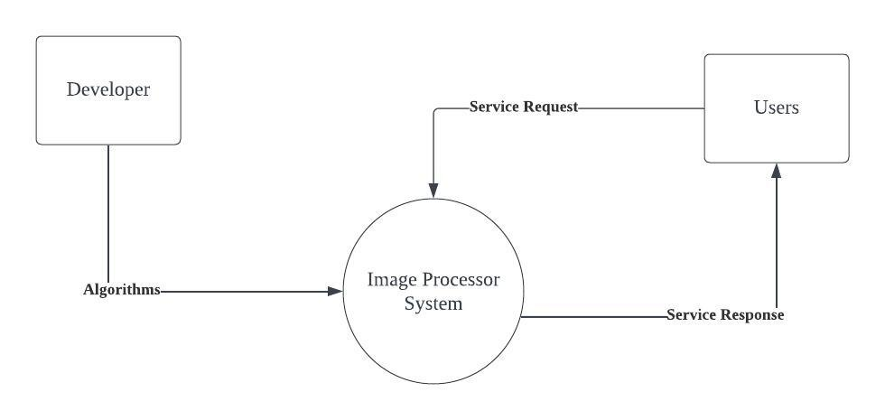

<div id="top"></div>

<br />
<div align="center">

<h3 align="center">Image Processor</h3>

  <p align="center">
   The image processor website that provides image processing services through gRPC APIs. The primary function of this website is to perform operations on the image data. Both the frontend and backend development of the website are done using JavaScript, which ensures a smooth integration and efficient development process.opment, ensuring seamless integration and development efficiency. 
  </p>
</div>

<!-- TABLE OF CONTENTS -->
<!-- <details>
  <summary>Table of Contents</summary>
  <ol>
    <li>
      <a href="#about-the-project">About The Project</a>
      <ul>
        <li><a href="#built-with">Built With</a></li>
      </ul>
    </li>
    <li>
      <a href="#getting-started">Getting Started</a>
      <ul>
        <li><a href="#prerequisites">Prerequisites</a></li>
        <li><a href="#installation">Installation</a></li>
      </ul>
    </li>
  </ol>
</details> -->

<!-- ABOUT THE PROJECT -->

## About The Project
<p>
This project aims to address the image processing problem, using gRPC API design to achieve fast response time. The system provides several operations like resize, rotate, flip, grayscale, and generate thumbnail version.  
</p>
<p align="right">(<a href="#top">back to top</a>)</p>

### Built With

- [React.js](https://reactjs.org/)
- [Node](https://nodejs.org/en/)
- [gRPC](https://grpc.io/)
- [Swagger](https://swagger.io/tools/swagger-editor/)

<p align="right">(<a href="#top">back to top</a>)</p>

### Context 
<p>
This project aims to address the image processing problem, using gRPC API design to achieve fast response time. The system provides several operations like resize, rotate, flip, grayscale, and generate thumbnail version.  
</p>
<div style="display: flex; justify-content: center;">
    
</div>

### Composition 
<div style="display: flex; justify-content: center;">
    
</div>

### Logical
<div style="display: flex; justify-content: center;">
    
</div>
<ul>
  <li><strong>Image load into request body:</strong>
    <ul>
      <li>This step does not include any API call; it describes the user selecting an image for the web UI. When the front end captures an image file, it adds the image data to the protocol buffer message body.</li>
    </ul>
  </li>
  <li><strong>Image Operation Request:</strong>
    <ul>
      <li>Users select operations (e.g., flipping, rotating, resizing, creating thumbnails, and applying grayscale filter) through the interface, and the client side stores these operations in the protocol buffer message body. The limitation here is that the current system design did not support edit operations list functionality.</li>
      <li>When the user clicks the “Generate” button on the frontend interface, if there is image data then the client calls the imageOperation API request to the backend, else if there is no image data, the error text will display.</li>
      <li>The backend decodes the image data in the protocol buffer, then performs the requested operations, and returns the result to the client.</li>
    </ul>
  </li>
</ul>


<!-- GETTING STARTED -->

### Interface
<div style="display: flex; justify-content: center;">
    
</div>

## Getting Started

To get a local copy up and running follow these simple example steps.


### Project Setup

- Run
    ```sh
        npm install
    ```

### Envoy

- Run

    ```sh
        docker-compose up -d
    ```

### Server

- Run

    ```sh
        cd src/
        node server.js
    ```

### Client

- To run the app

  ```sh
    npm start
  ```

### API Documentation

- The live API documentation is host on http://localhost:8081/api-docs/


<p align="right">(<a href="#top">back to top</a>)</p>